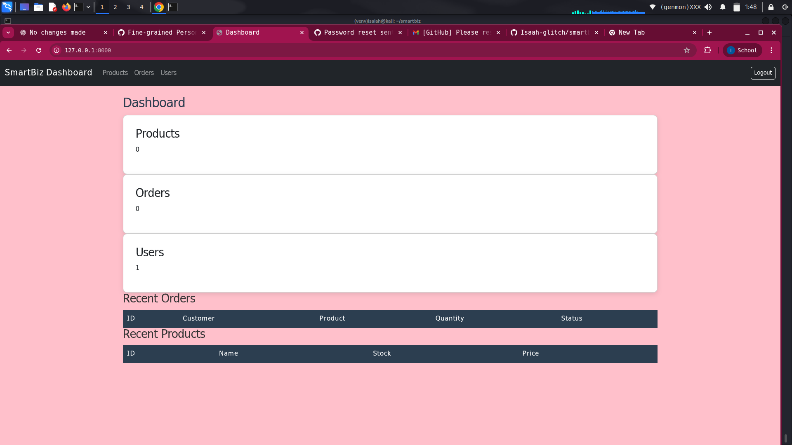
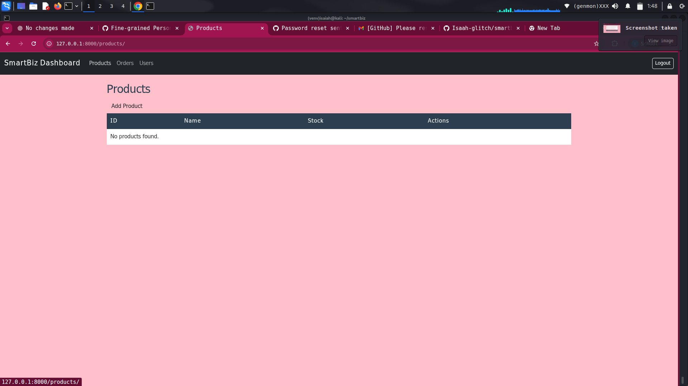
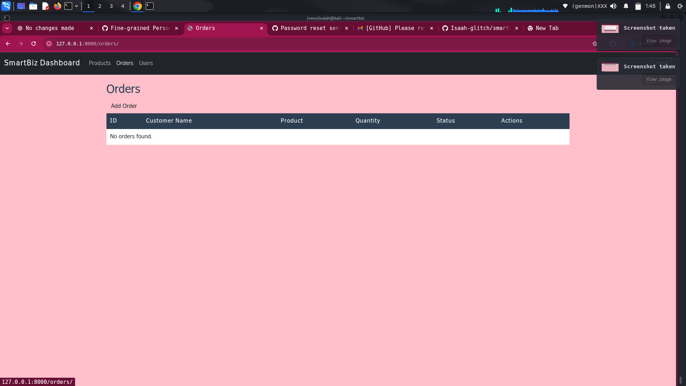
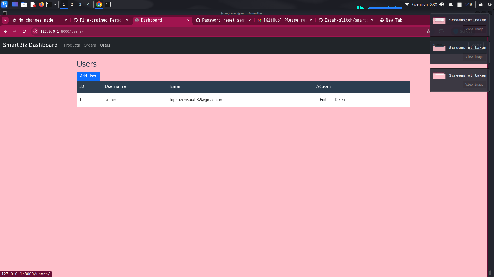
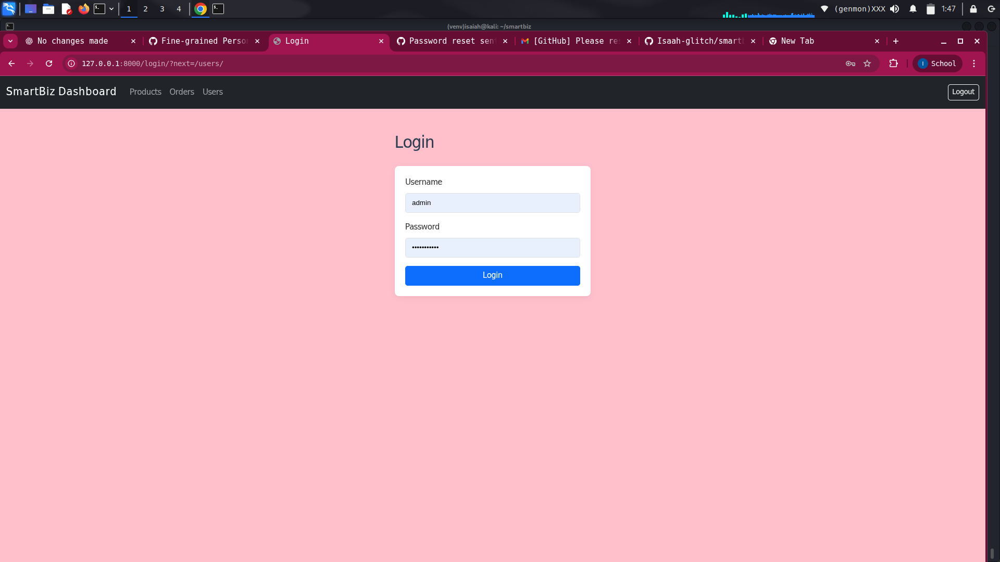
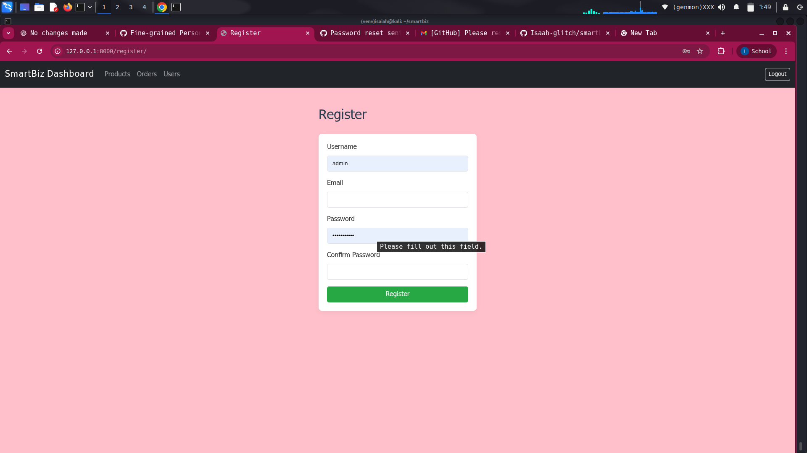

# SmartBiz Dashboard

SmartBiz Dashboard is a Django-based web application for managing products, orders, and users in a small business environment. It provides a clean, responsive interface for tracking inventory, processing orders, and managing user accounts.

---

## Features

- **Dashboard Home:** Quick overview of system stats.
- **Products Management:** Add, edit, delete, and view products.
- **Orders Management:** Track orders, including customer details, product, quantity, and status.
- **Users Management:** Add, edit, delete, and view users.
- **Authentication:** Login and register users with secure authentication.
- **Responsive Design:** Mobile-friendly UI using Bootstrap 5.
- **Single CSS file:** All pages share a unified styling using `style.css`.

---

## Screenshots

### Dashboard Home


### Products Page


### Orders Page


### Users Page


### Login Page


### Register Page


---

## Installation

1. Clone the repository:

```bash
git clone git@github.com:Isaah-glitch/smartbiz_dashboard.git
cd smartbiz_dashboard
